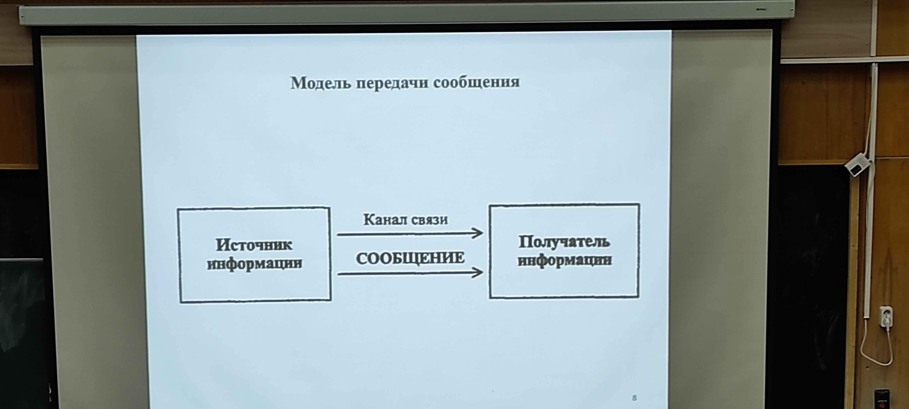
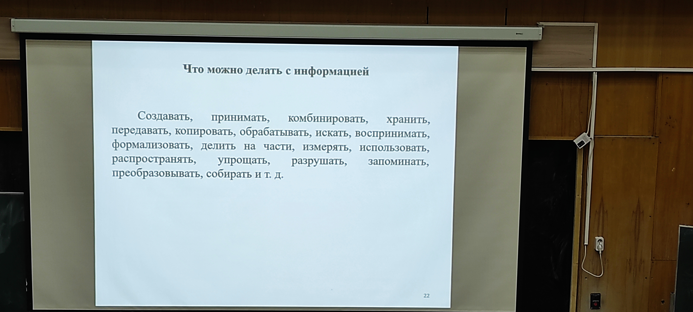

Агуреев Иван Александрович - 8-967-048-07-04

При лабах если есть военник + бал
----------------------------------

#### Информационная безопасность - защищенность информации и поддерживающей инфраструктуры о тслучайнох или преднамеренных вохдействий естественного или искуственного характера, способных нанести ущерб владельцам или пользователям информации и поддерживабщей инфраструктуры 

149 ФЗ от 27 июля 2006 - закон об информации
информация - сведения (сообщения, данные) независимо от формы их представления 

 #### Сведения - это знания, выраженные в сигналах, сообщениях, известиях, уведомлениях и т.д. Каждого человека в мире окружает море информации различных видов
    - Экономическя;
    - Технической;
    - Генетической.

Информация всегда связана с материальным носителем, то есть средой для записи и хранения информации.

####  Сигнал - способ передачи информации. Он представлеяет собой физический процесс, имеющий информационное значения.

#### Процессы получения, хранения транспортировки (то есть передачи на расстоянии). Преобразования и представления информации называют информационными процессами

#### Информационные ресурсы - по законадательству РФ - отдельные документы и одтельные массивы документов в информационныз системах; библиотеках, архивах, фондах, банках данных, других выдах информационных систем.

- Цифровая экономика - это экономика, существующая в условиях гибридного мира
- Гибридный мир - это результат слияния реального и виртуального миров, отличающийся возможностью совершения всех жизненно необходимых действий в реальном мире. Высокая эффективность и низкая стоимость.
- Облачные выччисления (Cloud computing) - информационно-технологическая концепция, подразумавающая обеспечение повсеместного и удобного сетевого доступа по требованию к общему объему конфигурируемых вычислительных ресурсов.
- интернет вещей - это концепция, объединяющая множество технологий, подразумавающая оснащенность датчиками и подключение к интернету всех приборов, что позволяет реализовать удаленный мониторинг, контроль, управление процессами.
- Большие данные (big data) - совокупность подходов, инструментов и методов, предназначенных для обработки структурированных и неструктурированных данных с целью получения воспринимвемых человеком результатов.

# Виртуальные валюты
- Виртуальная валюта - денежные средства, не имеющие материального воплощения, которые могут использоваться как полноценный денежный знак;
- Криптовалюта - это тип виртуальной валюты, эмиссия (добыча, майнинг) которого основана на специфическом применении криптографических алгоритмов;
- Биткоин - это первая и самая распрастраненная из существующих виртуальных валют - использует технологию Блокчейн.

Можно выделить два полярных подхода у построению "Цифровой" экономики: плановый и рыночный
Рыночный подход к построению "цифровой" экономики предполагает, что государство создает оптимальные условия, в первую очередь благоприятную среду для фккционирования "цифровой экономики, чем стимулирует бизнес к переходу в этот новый сектор.

## Кадры цифровой экономики
 - цифровая экономика - это хозяйственная деятельность, в которой ключевым фактором производства являются данные в цифровом виде, обработка больших объемов и использование результатов анализа по которых по сравнению с традиционными фрпмвми хозяйствования позволяют повысить эффективность различных видов производства, технологий, хранения, продажи, доставки товаров и услуг.

Профессиональный стандарт - это характеристика квалификации, необходииой работнику для осуществления определенного вида профессиональной деятельности.

## Уровни программистов
- **Junior** - студент последних курсов практически без опыта работы (дно);
- **Middle** - работает быстро, можно доверять работу как ответственную, так и не очень может помогать junio-рам;
- **Senior** - обычно специалист-профессионал, один из лучших сотрудников в компании. Такой специалист способен выполнить любую работу в рамках профессии.

